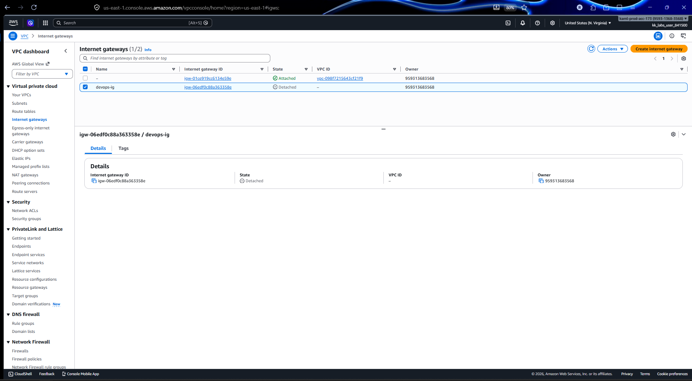

# Day 40: Troubleshooting Internet Accessibility for an EC2-Hosted Application

The Nautilus Development Team recently deployed a new web application hosted on an EC2 instance within a public VPC named `devops-vpc`. The application, running on an Nginx server, should be accessible from the internet on port 80. Despite configuring the security group `devops-sg` to allow traffic on port 80 and verifying the EC2 instance settings, the application remains inaccessible from the internet. The team suspects that the issue might be related to the VPC configuration, as all other components appear to be set up correctly. The DevOps team has been asked to troubleshoot and resolve the issue to ensure the application is accessible to external users.

As a member of the Nautilus DevOps Team, your task is to perform the following:

1. Verify VPC Configuration: Ensure that the VPC `devops-vpc` is properly configured to allow internet access.
2. Ensure Accessibility: Make sure the EC2 instance `devops-ec2` running the Nginx server is accessible from the internet on port 80.

Use below given AWS Credentials: (You can run the `showcreds` command on `aws-client` host to retrieve these credentials)\
`Notes:`

* Create the resources only in `us-east-1` region.<br>

***

## Fixing Internet Accessibility for EC2 in a Public VPC

### Overview

The Nautilus DevOps Team deployed a web application on an EC2 instance (`devops-ec2`) running Nginx inside a VPC named `devops-vpc`. The application was expected to be accessible over the internet via port 80 but was not reachable despite correct security group configuration.

This document explains the root cause, investigation steps, and resolution.

***

### Architecture Components

* VPC: `devops-vpc`
* EC2 Instance: `devops-ec2`
* Security Group: `devops-sg` (allows inbound port 80)
* Route Table: `devops-rtb`
* Internet Gateway: `igw-06edf0c88a363358e`

***

### Problem Statement

* EC2 instance had a public IP: `13.220.8.86`
* Security group allowed inbound HTTP (port 80)
* Nginx was running on the instance
* Application was not accessible from the internet

***

### Initial Verification

#### Test Connectivity

```bash
curl 13.220.8.86
```

#### Result

```bash
^C
```

Connection attempt failed, indicating a networking issue.

***

### Route Table Verification

```bash
aws ec2 describe-route-tables \
  --route-table-ids rtb-021a26ef629894643 \
  --region us-east-1 \
  --query 'RouteTables[].Routes[?DestinationCidrBlock==`0.0.0.0/0`].[GatewayId,State,join(``,[`IGW_Attached_To=`, to_string(@)])]' \
  --output table
```

#### Observation

Initially, the route to `0.0.0.0/0` was in a **blackhole** state, indicating that the Internet Gateway was either not attached or invalid.

***

### Root Cause

The Internet Gateway was **not attached** to the VPC (`devops-vpc`).

Because of this:

* The default route (`0.0.0.0/0`) had no valid target
* Traffic from the internet could not reach the EC2 instance

***

### Resolution (GUI Method)

#### Step 1: Navigate to VPC Console

* Open AWS Console
* Go to VPC Dashboard
* Select **Internet Gateways**

***

#### Step 2: Attach Internet Gateway

* Select: `igw-06edf0c88a363358e`
* Click **Actions → Attach to VPC**
* Choose VPC: `devops-vpc`

***

#### Step 3: Verify Route Table

* Navigate to **Route Tables**
* Select `devops-rtb`
* Confirm route:

| Destination | Target                | Status |
| ----------- | --------------------- | ------ |
| 0.0.0.0/0   | igw-06edf0c88a363358e | Active |

***

### Verification via CLI

#### Check Route Status

```bash
aws ec2 describe-route-tables \
  --route-table-ids rtb-021a26ef629894643 \
  --region us-east-1 \
  --query 'RouteTables[].Routes[?DestinationCidrBlock==`0.0.0.0/0`].[GatewayId,State,join(``,[`IGW_Attached_To=`, to_string(@)])]' \
  --output table && \
aws ec2 describe-internet-gateways \
  --internet-gateway-ids igw-06edf0c88a363358e \
  --region us-east-1 \
  --query 'InternetGateways[].Attachments[].VpcId' \
  --output text
```

#### Output

```bash
-------------------------------------------------------------------------------------------------------------------------------------------------------------------------
|                                                                          DescribeRouteTables                                                                          |
+-----------------------+---------+-------------------------------------------------------------------------------------------------------------------------------------+
|  igw-06edf0c88a363358e|  active |  IGW_Attached_To={"DestinationCidrBlock":"0.0.0.0/0","GatewayId":"igw-06edf0c88a363358e","Origin":"CreateRoute","State":"active"}   |
+-----------------------+---------+-------------------------------------------------------------------------------------------------------------------------------------+
vpc-056a2f562c8d332a3
```

***

### Final Connectivity Test

```bash
curl 13.220.8.86
```

#### Output

```html
<!DOCTYPE html>
<html>
<head>
<title>Welcome to nginx!</title>
...
<h1>Welcome to nginx!</h1>
...
</html>
```

***

### Conclusion

The issue was caused by a missing Internet Gateway attachment to the VPC. Once the Internet Gateway was attached:

* The route table became active
* Internet traffic was properly routed
* The EC2-hosted Nginx application became accessible

***

### Key Takeaways

* A public subnet requires:
  * Internet Gateway attached to the VPC
  * Route table with `0.0.0.0/0` pointing to the IGW
* A route in **blackhole** state indicates an invalid or detached target
* Always verify:
  * IGW attachment
  * Route table status
  * Subnet association

***

<figure><figcaption></figcaption></figure>

<figure><figcaption></figcaption></figure>

<figure><figcaption></figcaption></figure>

<figure><figcaption></figcaption></figure>

<figure><figcaption></figcaption></figure>

<figure><figcaption></figcaption></figure>

